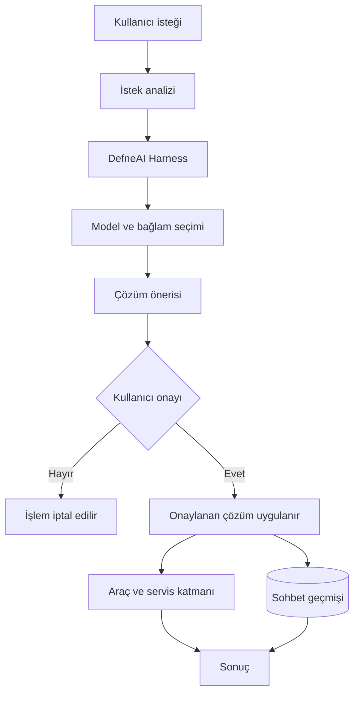

<div align="center">

# 🌿 DefneAI

### Geliştiriciler için güvenli, genişletilebilir ve çok sağlayıcılı AI harness platformu

DefneAI; kullanıcı isteklerini analiz eden, uygun model ve araçları bir araya getiren, çözümünü kullanıcı onayına sunan ve yalnızca izin verildikten sonra uygulayan terminal tabanlı bir AI asistanıdır.

<br />


</div>

---

## DefneAI nedir?

DefneAI, geliştiricilerin günlük işlerini doğal dil kullanarak gerçekleştirebilmesini amaçlayan bir AI harness platformudur.

Kullanıcıdan gelen istekler önce analiz edilir. Ardından gerekli model, sohbet bağlamı ve kullanılabilir araçlar bir araya getirilerek uygulanabilir bir çözüm hazırlanır.

Hazırlanan çözüm doğrudan çalıştırılmaz. Önce kullanıcıya gösterilir ve açık onay beklenir. Dosya değiştirme, komut çalıştırma veya uygulama yönetimi gibi işlemler yalnızca kullanıcı izin verdiğinde gerçekleştirilir.

> DefneAI’de **harness**; modelleri, araçları, konuşma bağlamını, yönlendirme mekanizmasını ve güvenli execution akışını bir araya getiren çalışma katmanını ifade eder.

---

## ✨ Öne çıkan özellikler

### 🧠 Akıllı istek analizi

DefneAI, kullanıcı isteğini çalıştırmadan önce analiz eder ve uygulanacak işleme uygun bir çalışma akışı oluşturur.

Bu analiz sayesinde:

- Kullanıcının amacı anlaşılır
- İlgili konuşma bağlamı korunur
- Uygun model yapılandırması seçilir
- Gerekli araçlar belirlenir
- İlgisiz işlemlerin önüne geçilir

### 🧩 Harness tabanlı mimari

DefneAI’nin harness katmanı aşağıdaki bileşenleri tek bir çalışma akışında bir araya getirir:

- AI model sağlayıcıları
- Model yapılandırmaları
- Sohbet geçmişi
- Tool calling altyapısı
- Kullanıcı onay mekanizması
- Execution servisleri
- Kalıcı veri yönetimi

Bu yapı sayesinde yeni modeller, araçlar ve çalışma davranışları mevcut mimari bozulmadan sisteme eklenebilir.

### ✅ Onay tabanlı execution

DefneAI, kullanıcı adına doğrudan işlem yapmaz.

Her istek için önce uygulanabilir bir çözüm önerisi oluşturulur:

```text
Önerilen çözüm:
...

Çözüm uygulansın mı? [y/N]
```

Kullanıcı onay verirse çözüm uygulanır. Onay verilmediğinde dosyalar, uygulamalar ve sistem durumu değiştirilmez.

### 🔌 Çoklu model sağlayıcısı

DefneAI, OpenAI uyumlu API sunan yerel ve bulut tabanlı model sağlayıcılarıyla çalışabilir:

| Sağlayıcı | Varsayılan endpoint |
|---|---|
| Ollama | `http://localhost:11434/v1` |
| LM Studio | `http://localhost:1234/v1` |
| OpenAI | `https://api.openai.com/v1` |
| OpenRouter | `https://openrouter.ai/api/v1` |
| Groq | `https://api.groq.com/openai/v1` |
| DeepSeek | `https://api.deepseek.com/v1` |
| Gemini | `https://generativelanguage.googleapis.com/v1beta/openai/` |

Model yapılandırmaları dinamik olarak sisteme eklenebilir, güncellenebilir veya devre dışı bırakılabilir.

### 🛠️ Genişletilebilir araç altyapısı

DefneAI içerisinde farklı otomasyon senaryoları için yeniden kullanılabilir araç servisleri bulunur:

- Dosya içeriği okuma
- Dosya oluşturma ve düzenleme
- Dosya veya bağlantı açma
- Dosya silme
- PowerShell komutları çalıştırma
- Uygulama açma ve kapatma
- Uygulama durumunu kontrol etme
- Web bağlantılarını tarayıcıda açma
- YouTube üzerinde video arama
- Seçilen YouTube videosunu açma
- Model ve sohbet yönetimi

Yeni araçlar Infrastructure katmanına eklenerek harness tarafından kullanılabilir hale getirilebilir.

### 💬 Kalıcı sohbet geçmişi

DefneAI, PostgreSQL ve Entity Framework Core kullanarak konuşma bağlamını oturumlar arasında koruyabilir.

Saklanabilen veriler:

- Sohbetler
- Kullanıcı istekleri
- Harness cevapları
- Önerilen çözümler
- Kullanılan model bilgileri
- İsteklerin execution durumları

Kullanıcı daha önce oluşturduğu bir sohbete geçebilir ve kaldığı yerden devam edebilir.

### 🖥️ Terminal odaklı kullanıcı deneyimi

Spectre.Console tabanlı terminal arayüzü:

- Sabit prompt alanı
- UTF-8 desteği
- Renkli durum mesajları
- Dinamik terminal boyutlandırma
- Sohbet geçmişi yönetimi
- Thinking, Executing, Completed ve Failed durumları

sunar.

---

## ⚙️ DefneAI nasıl çalışır?



1. Kullanıcının isteği terminal üzerinden alınır.
2. İstek analiz edilir ve ilgili bağlam hazırlanır.
3. Harness gerekli model ve servisleri bir araya getirir.
4. Uygulanabilir bir çözüm önerisi oluşturulur.
5. Çözüm kullanıcıya gösterilir.
6. Kullanıcıdan açık onay istenir.
7. Onaylanan çözüm gerekli araçlar kullanılarak uygulanır.
8. İstek ve cevaplar sohbet geçmişine kaydedilir.
9. İşlem sonucu kullanıcıya gösterilir.

---

## 🏗️ Proje mimarisi

DefneAI katmanlı ve genişletilebilir bir mimariye sahiptir:

```text
DefneAI/
├── DefneAI/                  # Console uygulaması ve başlangıç noktası
├── DefneAI.Application/      # İş akışları, sözleşmeler ve yönlendirme
├── DefneAI.Domain/           # Domain modelleri ve enumlar
├── DefneAI.Infrastructure/   # Harness, model, araç ve execution servisleri
├── DefneAI.Persistence/      # EF Core ve PostgreSQL repository katmanı
└── DefneAI.slnx              # .NET solution dosyası
```

### Katmanların sorumlulukları

| Katman | Sorumluluk |
|---|---|
| `DefneAI` | Dependency injection, terminal arayüzü ve uygulama başlangıcı |
| `Application` | Prompt analizi, routing, state yönetimi ve servis sözleşmeleri |
| `Domain` | Sohbet, prompt, model ve cevap varlıkları |
| `Infrastructure` | Harness, model sağlayıcıları, araçlar ve execution servisleri |
| `Persistence` | PostgreSQL erişimi ve repository implementasyonları |

---

## 🚀 Kurulum

### Gereksinimler

Başlamadan önce aşağıdaki araçların kurulu olması gerekir:

- [.NET 10 SDK](https://dotnet.microsoft.com/download)
- [Ollama](https://ollama.com/) veya desteklenen başka bir model sağlayıcısı
- PostgreSQL
- Git
- ANSI destekleyen bir terminal

> DefneAI’nin mevcut otomasyon araçları ağırlıklı olarak Windows ve PowerShell ortamını hedeflemektedir.

### 1. Projeyi klonlayın

```bash
git clone https://github.com/emreucbudak/DefneAI.git
cd DefneAI
```

### 2. Yerel model sağlayıcısını hazırlayın

Ollama kullanılacaksa servis çalıştırılmalıdır:

```bash
ollama serve
```

Kullanmak istediğiniz modeli Ollama üzerinden indirebilirsiniz:

```bash
ollama pull <model-name>
```

Ollama için varsayılan OpenAI uyumlu endpoint:

```text
http://localhost:11434/v1
```

LM Studio kullanılıyorsa varsayılan endpoint:

```text
http://localhost:1234/v1
```

### 3. PostgreSQL bağlantısını ayarlayın

PowerShell:

```powershell
$env:DEFNEAI_DB_CONNECTION="Host=localhost;Port=5432;Database=defneai;Username=postgres;Password=your-password"
```

Alternatif environment variable:

```powershell
$env:ConnectionStrings__DefaultConnection="Host=localhost;Port=5432;Database=defneai;Username=postgres;Password=your-password"
```

> Tam harness execution, model yönetimi ve kalıcı sohbet geçmişi için PostgreSQL bağlantısı gereklidir.

### 4. Bağımlılıkları yükleyin

```bash
dotnet restore
```

### 5. Projeyi derleyin

```bash
dotnet build DefneAI.slnx
```

### 6. DefneAI’yi çalıştırın

```bash
dotnet run --project DefneAI/DefneAI.csproj
```

---

## 💻 CLI komutları

| Komut | Açıklama |
|---|---|
| `/komutlar` | Kullanılabilir komutları listeler |
| `/yenichat` | Yeni bir sohbet oluşturur ve aktif hale getirir |
| `/sohbetler` | Kayıtlı sohbetleri tarihleriyle listeler |
| `/chatsec {chatId}` | Belirtilen sohbete geçer |
| `/chatsil [chatId]` | Belirtilen veya aktif sohbeti siler |
| `/modelekle ...` | Yeni model yapılandırması ekler |
| `/modellistele` | Kayıtlı modelleri listeler |
| `/modelguncelle ...` | Bir model yapılandırmasını günceller |
| `/modelsil {modelAdı}` | Bir modeli devre dışı bırakır |

### Model ekleme formatı

```text
/modelekle {modelAdı} {sağlayıcı} {apiKey} {amaç} {temperature} {priority} {açıklama}
```

Ollama örneği:

```text
/modelekle model-name ollama ollama default 0.3 1 Yerel model
```

OpenAI örneği:

```text
/modelekle model-name openai API_KEY default 0.7 1 Bulut modeli
```

Daha düşük `priority` değeri, model seçimi sırasında daha yüksek öncelik anlamına gelir.

---

## 🧰 Kullanılan teknolojiler

| Teknoloji | Kullanım alanı |
|---|---|
| .NET 10 | Uygulama çalışma zamanı |
| C# | Ana programlama dili |
| Microsoft Semantic Kernel | Harness ve model orkestrasyonu |
| Entity Framework Core | Veri erişimi |
| PostgreSQL / Npgsql | Kalıcı veri depolama |
| Spectre.Console | Terminal arayüzü |
| FluentValidation | Model yapılandırması doğrulama |
| YoutubeExplode | YouTube arama entegrasyonu |
| AngleSharp | Web içeriği işleme |
| MemoryCache | Dinamik kernel önbellekleme |

---

## 🔐 Güvenlik yaklaşımı

DefneAI, durum değiştirebilecek işlemlerden önce kullanıcı onayı ister.

Proje güçlü otomasyon araçları içerdiğinden yalnızca güvenilir ortamlarda çalıştırılmalıdır:

- PowerShell komutu çalıştırma
- Dosya içeriği değiştirme
- Dosya silme
- Uygulama açma ve kapatma
- Harici bağlantıları açma

API anahtarlarını kaynak koduna veya Git geçmişine eklemeyin. Geliştirme sırasında sınırlı yetkiye sahip anahtarlar ve izole test ortamları kullanın.

---

## 🧭 Tasarım prensipleri

- **Approval first:** Kullanıcı onayı olmadan çözüm uygulanmaz.
- **Provider independence:** Tek bir model sağlayıcısına bağımlı kalınmaz.
- **Context awareness:** Sohbet geçmişi çalışma akışına dahil edilir.
- **Layered architecture:** Domain ve uygulama mantığı altyapıdan ayrılır.
- **Extensible tooling:** Yeni araçlar kolayca sisteme eklenebilir.
- **Configurable models:** Model ayarları dinamik olarak yönetilebilir.
- **Persistent history:** Konuşma geçmişi oturumlar arasında korunabilir.
- **Controlled execution:** Harness yalnızca onaylanan çözümü uygular.

---

## 🤝 Katkıda bulunma

Katkılar, hata bildirimleri ve geliştirme önerileri memnuniyetle karşılanır.

1. Projeyi fork edin.
2. Yeni bir branch oluşturun:

```bash
git checkout -b feature/yeni-ozellik
```

3. Değişikliklerinizi commit edin:

```bash
git commit -m "Add new feature"
```

4. Branch’inizi push edin:

```bash
git push origin feature/yeni-ozellik
```

5. Pull request oluşturun.

---

<div align="center">

### 🌿 DefneAI

**Geliştiriciler için izin kontrollü, genişletilebilir AI harness platformu.**

</div>
