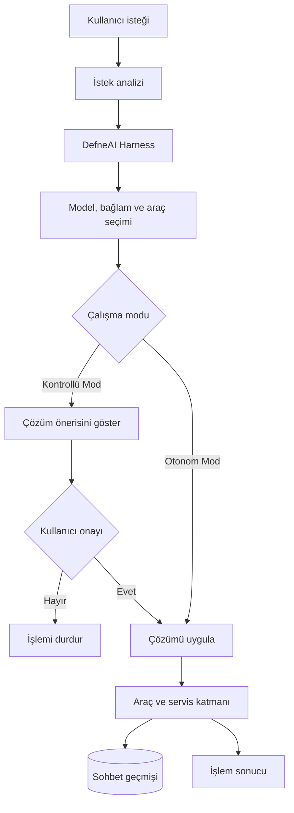

<div align="center">

# 🌿 DefneAI

### Geliştiriciler için çok sağlayıcılı ve genişletilebilir AI harness platformu

DefneAI; kullanıcı isteklerini analiz eden, model ve araçları tek bir çalışma akışında birleştiren terminal tabanlı bir AI asistanıdır.

Kullanıcı, çalışma şekline göre DefneAI’yi **Otonom Mod** veya **Kontrollü Mod** ile kullanabilir.

<br />


</div>

---

## DefneAI nedir?

DefneAI, geliştiricilerin doğal dil kullanarak dosyalar, uygulamalar, terminal komutları ve farklı AI modelleriyle çalışabilmesini sağlayan bir harness platformudur.

Kullanıcıdan gelen istek analiz edilir; gerekli model, konuşma bağlamı ve araçlar bir araya getirilerek uygulanabilir bir çalışma akışı oluşturulur.

> DefneAI’de **harness**; modelleri, araçları, konuşma bağlamını, yönlendirme mekanizmasını ve execution sürecini bir araya getiren çalışma katmanını ifade eder.

---

## 🎛️ Çalışma modları

DefneAI iki farklı çalışma modu sunar.

### 🚀 Otonom Mod

Otonom Mod’da kullanıcı, uygulama kontrolünü harness’a bırakır.

DefneAI verilen isteği analiz eder, gerekli adımları belirler ve her işlem için ayrıca izin istemeden çalışmayı tamamlar.

Bu mod:

- Hızlı ve kesintisiz çalışma sağlar
- Uzun süren görevlerde kullanıcı müdahalesini azaltır
- Birden fazla adımdan oluşan işleri otomatik tamamlar
- Tekrarlanan onay adımlarını ortadan kaldırır

Otonom Mod, güvenilir projelerde ve kullanıcının çalışma kapsamını açıkça belirlediği durumlarda tercih edilebilir.

### 🛡️ Kontrollü Mod

Kontrollü Mod’da DefneAI, uygulamak istediği çözümü önce kullanıcıya gösterir.

```text
Önerilen çözüm:
...

Çözüm uygulansın mı? [y/N]
```

Kullanıcı onay verirse çözüm uygulanır. Onay verilmezse dosyalar, uygulamalar veya sistem durumu değiştirilmez.

Bu mod:

- Yapılacak işlemlerin önceden incelenmesini sağlar
- Hassas projelerde kullanıcı kontrolünü korur
- İstenmeyen değişikliklerin önüne geçmeye yardımcı olur
- Yeni veya güvenilmeyen çalışma alanları için daha güvenli bir deneyim sunar

Kullanıcı, ihtiyacına göre kontrolü tamamen DefneAI’ye bırakabilir veya execution sürecini kendi onayına bağlayabilir.

---

## ✨ Öne çıkan özellikler

### 🧠 Akıllı istek analizi

DefneAI, kullanıcının isteğini analiz ederek gerekli bağlamı, model yapılandırmasını ve araçları belirler.

### 🧩 Harness tabanlı mimari

Harness katmanı aşağıdaki bileşenleri tek bir çalışma akışında birleştirir:

- AI model sağlayıcıları
- Model yapılandırmaları
- Sohbet geçmişi
- Tool calling altyapısı
- Çalışma modu yönetimi
- Execution servisleri
- Kalıcı veri yönetimi

### 🔌 Çoklu model sağlayıcısı

DefneAI, OpenAI uyumlu API sunan yerel ve bulut tabanlı sağlayıcılarla çalışabilir:

| Sağlayıcı | Varsayılan endpoint |
|---|---|
| Ollama | `http://localhost:11434/v1` |
| LM Studio | `http://localhost:1234/v1` |
| OpenAI | `https://api.openai.com/v1` |
| OpenRouter | `https://openrouter.ai/api/v1` |
| Groq | `https://api.groq.com/openai/v1` |
| DeepSeek | `https://api.deepseek.com/v1` |
| Gemini | `https://generativelanguage.googleapis.com/v1beta/openai/` |

### 🛠️ Genişletilebilir araç altyapısı

DefneAI içerisinde farklı otomasyon senaryoları için araç servisleri bulunur:

- Dosya okuma ve düzenleme
- Dosya veya bağlantı açma
- Dosya silme
- PowerShell komutları çalıştırma
- Uygulama açma ve kapatma
- Uygulama durumunu kontrol etme
- Web bağlantılarını açma
- YouTube üzerinde video arama
- Model ve sohbet yönetimi

### 💬 Kalıcı sohbet geçmişi

PostgreSQL ve Entity Framework Core üzerinden:

- Sohbetler
- Kullanıcı istekleri
- Harness cevapları
- Kullanılan modeller
- Execution sonuçları

saklanabilir ve daha sonra tekrar yüklenebilir.

### 🖥️ Terminal deneyimi

Spectre.Console tabanlı terminal arayüzü:

- Sabit prompt alanı
- UTF-8 desteği
- Renkli durum mesajları
- Dinamik terminal boyutlandırma
- Sohbet geçmişi yönetimi
- Execution durumu takibi

sunar.

---

## ⚙️ Çalışma akışı



### Kontrollü Mod akışı

1. Kullanıcı isteği analiz edilir.
2. Harness bir çözüm önerisi hazırlar.
3. Çözüm kullanıcıya gösterilir.
4. Kullanıcıdan onay beklenir.
5. Yalnızca onaylanan çözüm uygulanır.

### Otonom Mod akışı

1. Kullanıcı isteği analiz edilir.
2. Harness gerekli adımları belirler.
3. Uygun model ve araçlar hazırlanır.
4. İşlemler ayrıca onay istenmeden uygulanır.
5. Sonuç kullanıcıya sunulur.

---

## 🏗️ Proje mimarisi

```text
DefneAI/
├── DefneAI/                  # Console uygulaması ve başlangıç noktası
├── DefneAI.Application/      # İş akışları, sözleşmeler ve yönlendirme
├── DefneAI.Domain/           # Domain modelleri ve enumlar
├── DefneAI.Infrastructure/   # Harness, model, araç ve execution servisleri
├── DefneAI.Persistence/      # EF Core ve PostgreSQL repository katmanı
└── DefneAI.slnx              # .NET solution dosyası
```

| Katman | Sorumluluk |
|---|---|
| `DefneAI` | Dependency injection, terminal arayüzü ve uygulama başlangıcı |
| `Application` | Prompt analizi, routing ve servis sözleşmeleri |
| `Domain` | Sohbet, prompt, model ve cevap varlıkları |
| `Infrastructure` | Harness, model sağlayıcıları, araçlar ve execution |
| `Persistence` | PostgreSQL erişimi ve repository implementasyonları |

---

## 🚀 Kurulum

### Gereksinimler

- [.NET 10 SDK](https://dotnet.microsoft.com/download)
- [Ollama](https://ollama.com/) veya desteklenen başka bir model sağlayıcısı
- PostgreSQL
- Git
- ANSI destekleyen bir terminal

> Mevcut otomasyon araçları ağırlıklı olarak Windows ve PowerShell ortamını hedeflemektedir.

### Projeyi klonlayın

```bash
git clone https://github.com/emreucbudak/DefneAI.git
cd DefneAI
```

### PostgreSQL bağlantısını ayarlayın

```powershell
$env:DEFNEAI_DB_CONNECTION="Host=localhost;Port=5432;Database=defneai;Username=postgres;Password=your-password"
```

Alternatif olarak:

```powershell
$env:ConnectionStrings__DefaultConnection="Host=localhost;Port=5432;Database=defneai;Username=postgres;Password=your-password"
```

### Projeyi derleyin

```bash
dotnet restore
dotnet build DefneAI.slnx
```

### DefneAI’yi çalıştırın

```bash
dotnet run --project DefneAI/DefneAI.csproj
```

---

## 💻 CLI komutları

| Komut | Açıklama |
|---|---|
| `/komutlar` | Kullanılabilir komutları listeler |
| `/yenichat` | Yeni sohbet oluşturur |
| `/sohbetler` | Kayıtlı sohbetleri listeler |
| `/chatsec {chatId}` | Belirtilen sohbete geçer |
| `/chatsil [chatId]` | Belirtilen veya aktif sohbeti siler |
| `/modelekle ...` | Yeni model yapılandırması ekler |
| `/modellistele` | Kayıtlı modelleri listeler |
| `/modelguncelle ...` | Model yapılandırmasını günceller |
| `/modelsil {modelAdı}` | Modeli devre dışı bırakır |

---

## 🧰 Kullanılan teknolojiler

| Teknoloji | Kullanım alanı |
|---|---|
| .NET 10 | Uygulama çalışma zamanı |
| C# | Ana programlama dili |
| Microsoft Semantic Kernel | Harness ve model orkestrasyonu |
| Entity Framework Core | Veri erişimi |
| PostgreSQL / Npgsql | Kalıcı veri depolama |
| Spectre.Console | Terminal arayüzü |
| FluentValidation | Yapılandırma doğrulama |
| YoutubeExplode | YouTube entegrasyonu |
| AngleSharp | Web içeriği işleme |
| MemoryCache | Dinamik kernel önbellekleme |

---

## 🔐 Güvenlik

Çalışma modu, kullanılacak ortama göre seçilmelidir.

- **Kontrollü Mod**, hassas projeler ve önceden incelenmesi gereken işlemler için uygundur.
- **Otonom Mod**, güvenilir çalışma alanlarında ve kapsamı açıkça belirlenmiş görevlerde kullanılmalıdır.

Otonom Mod aşağıdaki işlemleri ayrıca izin istemeden gerçekleştirebilir:

- Terminal komutu çalıştırma
- Dosya oluşturma veya değiştirme
- Dosya silme
- Uygulama açma veya kapatma
- Harici bağlantıları açma

API anahtarlarını kaynak koduna veya Git geçmişine eklemeyin. Otonom Mod’u kullanmadan önce çalışma dizinini ve verilen görevin kapsamını kontrol edin.

---

## 🤝 Katkıda bulunma

1. Projeyi fork edin.
2. Yeni bir branch oluşturun:

```bash
git checkout -b feature/yeni-ozellik
```

3. Değişikliklerinizi commit edin:

```bash
git commit -m "Add new feature"
```

4. Branch’inizi push edin:

```bash
git push origin feature/yeni-ozellik
```

5. Pull request oluşturun.

---

<div align="center">

### 🌿 DefneAI

**Kontrolün sizde veya harness’ta olduğu geliştirici odaklı AI platformu.**

</div>
